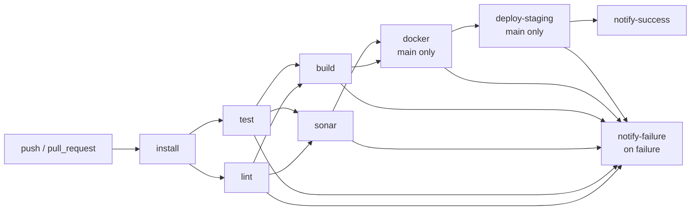
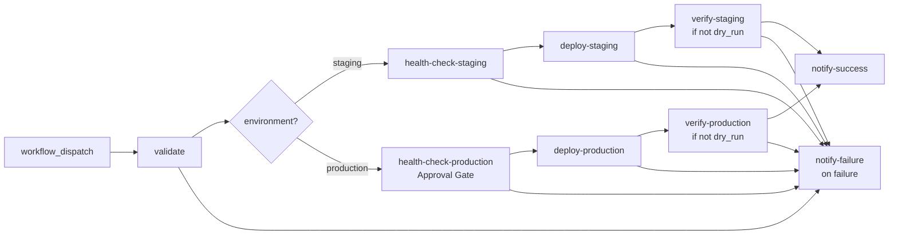
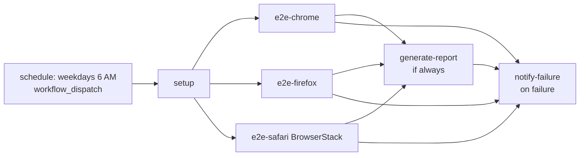

# 🚀 Jenkins to GitHub Actions Migration Report

## 📊 Migration Overview

| Metric             | Before (Jenkins)             | After (GitHub Actions)                                    |
| ------------------ | ---------------------------- | --------------------------------------------------------- |
| Pipeline Files     | 3 Jenkinsfiles               | 3 workflows                                               |
| Shared Libraries   | 2 (`buildDocker`, `notifySlack`) | Expanded inline in all 3 workflows                    |
| Pipeline Stages    | 22 stages (across 3 files)   | 27 jobs (across 3 workflows)                              |
| Parallel Stages    | 1 parallel block (3 browsers)| 3 concurrent jobs (`e2e-chrome`, `e2e-firefox`, `e2e-safari`) |
| Jenkins Credentials| 6 credential bindings        | 7 GitHub Secrets                                          |
| Approval Gate      | `input()` step (production)  | GitHub Environment with required reviewers                |
| Triggers           | `pollSCM`, `cron`, manual    | `push`, `pull_request`, `schedule`, `workflow_dispatch`   |

## 📁 Archived Original Files

| Original Location           | Archived As                                     |
| --------------------------- | ----------------------------------------------- |
| `Jenkinsfile`               | `.github/ci-archive/Jenkinsfile`                |
| `deploy/Jenkinsfile`        | `.github/ci-archive/deploy-Jenkinsfile`         |
| `nightwatch/Jenkinsfile`    | `.github/ci-archive/nightwatch-Jenkinsfile`     |
| `vars/buildDocker.groovy`   | `.github/ci-archive/buildDocker.groovy`         |
| `vars/notifySlack.groovy`   | `.github/ci-archive/notifySlack.groovy`         |

## 📂 New Workflow Files

| Workflow File                              | Purpose                                             | Source Jenkinsfile       |
| ------------------------------------------ | --------------------------------------------------- | ------------------------ |
| `.github/workflows/ci.yml`                 | Main CI pipeline — lint, test, SonarQube, Docker, staging deploy | `Jenkinsfile` |
| `.github/workflows/deploy.yml`             | Parameterised deployment pipeline with approval gate | `deploy/Jenkinsfile`   |
| `.github/workflows/e2e-tests.yml`          | Parallel E2E browser tests (Chrome, Firefox, Safari) | `nightwatch/Jenkinsfile` |

## 🔄 Conversion Diagram

### ci.yml — Main CI Pipeline



### deploy.yml — Deployment Pipeline



### e2e-tests.yml — E2E Parallel Tests



## 🔧 Key Transformations

### Stage and Job Conversions

#### Jenkinsfile → ci.yml
| Jenkins Stage              | GitHub Actions Job    | Notes                                          |
| -------------------------- | --------------------- | ---------------------------------------------- |
| `Checkout` + `Install Dependencies` | `install`  | Combined; node_modules shared via artifact     |
| `Lint`                     | `lint`                | Depends on `install`                           |
| `Unit Tests`               | `test`                | Depends on `install`; uploads coverage artifact|
| `SonarQube Analysis` + `Quality Gate` | `sonar` | Uses `SonarSource/sonarqube-scan-action` + `sonarqube-quality-gate-action` |
| `Build`                    | `build`               | Depends on `lint` + `test`                     |
| `Docker Build & Push`      | `docker`              | Main branch only; `buildDocker.groovy` inlined |
| `Deploy to Staging`        | `deploy-staging`      | Main branch only; `kubeconfig-staging` secret  |
| `post.success { slackSend }` | `notify-success`    | `notifySlack.groovy` inlined                   |
| `post.failure { slackSend }` | `notify-failure`    | `notifySlack.groovy` inlined                   |

#### deploy/Jenkinsfile → deploy.yml
| Jenkins Stage              | GitHub Actions Job           | Notes                                               |
| -------------------------- | ----------------------------- | --------------------------------------------------- |
| `Validate Parameters`      | `validate`                    | Checks `image_tag` not empty                        |
| `Approval` (production)    | `health-check-production` env | GitHub Environment with required reviewers          |
| `Pre-deploy Health Check`  | `health-check-staging/production` | Environment-scoped jobs                         |
| `Deploy`                   | `deploy-staging/production`   | Dry-run support preserved; environment-scoped       |
| `Post-deploy Verification` | `verify-staging/production`   | Skipped when `dry_run=true`                         |
| `Smoke Tests`              | Merged into `verify-*` jobs   | Merged with verification for efficiency             |
| `post.success/failure`     | `notify-success/failure`      | `notifySlack.groovy` inlined                        |

#### nightwatch/Jenkinsfile → e2e-tests.yml
| Jenkins Stage              | GitHub Actions Job    | Notes                                          |
| -------------------------- | --------------------- | ---------------------------------------------- |
| `Setup`                    | `setup`               | node_modules cached via artifact               |
| `E2E Tests` → `Chrome`     | `e2e-chrome`          | Parallel; runs concurrently with Firefox/Safari|
| `E2E Tests` → `Firefox`    | `e2e-firefox`         | Parallel                                       |
| `E2E Tests` → `Safari`     | `e2e-safari`          | Parallel; uses BrowserStack credentials        |
| `Generate Report`          | `generate-report`     | `if: always()` — runs even on test failure     |
| `post.failure { slackSend }` | `notify-failure`    | `notifySlack.groovy` inlined; channel `#qa-alerts` |

### Shared Library Expansions

#### `vars/buildDocker.groovy` — Inlined in `ci.yml` (docker job)

| Groovy Shared Library Code                           | GitHub Actions Equivalent                                      |
| ----------------------------------------------------- | -------------------------------------------------------------- |
| `sh "docker build -t ${fullImage} -t ${latestImage}"` | `docker/build-push-action@v6` with `tags:` (both tags)        |
| `sh "echo ${DOCKER_PASS} \| docker login ..."`        | `docker/login-action@v3` with `registry:`, `username:`, `password:` |
| `sh "docker push ${fullImage}"`                       | `push: true` in `docker/build-push-action`                    |
| `def buildArgsStr = buildArgs.collect {...}`          | `build-args:` block in `docker/build-push-action`             |
| `docker.build()` / `docker.withRegistry()`           | `docker/setup-buildx-action@v3` + `docker/login-action@v3`    |

#### `vars/notifySlack.groovy` — Inlined in all 3 workflows

| Groovy Shared Library Code                    | GitHub Actions Equivalent                                          |
| --------------------------------------------- | ------------------------------------------------------------------ |
| `switch(status) { case 'SUCCESS': color='good' }` | JSON payload with `"color": "good"` in `slackapi/slack-github-action` |
| `switch(status) { case 'FAILURE': color='danger' }` | JSON payload with `"color": "danger"`                          |
| `def defaultMessage = "${emoji} *${JOB_NAME}*..."` | Inline text with `${{ github.workflow }}`, `${{ github.run_number }}` |
| `slackSend(channel:, color:, message:)`       | `slackapi/slack-github-action@v2` with `payload:` JSON              |
| `<${env.BUILD_URL}\|View Build>`              | `${{ github.server_url }}/${{ github.repository }}/actions/runs/${{ github.run_id }}` |

### Credential Mappings

| Jenkins Credential                      | Jenkins Type          | GitHub Secret/Variable              |
| --------------------------------------- | --------------------- | ----------------------------------- |
| `npm-token`                             | String credential     | `secrets.NPM_TOKEN`                 |
| `docker-registry-creds` (user)          | Username/Password     | `secrets.DOCKER_REGISTRY_USER`      |
| `docker-registry-creds` (pass)          | Username/Password     | `secrets.DOCKER_REGISTRY_PASS`      |
| `kubeconfig-staging`                    | Secret file           | `secrets.KUBECONFIG_STAGING`        |
| `kubeconfig-production`                 | Secret file           | `secrets.KUBECONFIG_PRODUCTION`     |
| `browserstack-user`                     | String credential     | `secrets.BROWSERSTACK_USER`         |
| `browserstack-key`                      | String credential     | `secrets.BROWSERSTACK_KEY`          |
| SonarQube server token                  | Managed by Jenkins    | `secrets.SONAR_TOKEN`               |
| Slack webhook                           | Plugin config         | `secrets.SLACK_WEBHOOK_URL`         |

### Jenkins Environment Variable Mappings

| Jenkins Variable         | GitHub Actions Equivalent                                                          |
| ------------------------ | ---------------------------------------------------------------------------------- |
| `${env.BUILD_NUMBER}`    | `${{ github.run_number }}`                                                         |
| `${env.BUILD_URL}`       | `${{ github.server_url }}/${{ github.repository }}/actions/runs/${{ github.run_id }}` |
| `${env.JOB_NAME}`        | `${{ github.workflow }}`                                                           |
| `${env.BRANCH_NAME}`     | `${{ github.ref_name }}`                                                           |
| `${env.GIT_COMMIT}`      | `${{ github.sha }}`                                                                |
| `${currentBuild.result}` | `${{ job.status }}`                                                                |

### Options Translations

| Jenkins Option                            | GitHub Actions Equivalent                             |
| ----------------------------------------- | ----------------------------------------------------- |
| `timeout(time: 30, unit: 'MINUTES')`      | `timeout-minutes: 30` on each job                     |
| `disableConcurrentBuilds()`               | `concurrency:` group at workflow level (ci.yml)       |
| `timestamps()`                            | Built-in; always shown in GitHub Actions logs         |
| `buildDiscarder(logRotator(...))`         | Managed via repository-level artifact retention       |
| `pollSCM('H/5 * * * *')`                 | `on: push:` + `on: pull_request:` (event-driven)     |
| `cron('0 6 * * 1-5')`                    | `on: schedule: - cron: '0 6 * * 1-5'`                |

### Plugin Replacements

| Jenkins Plugin / Feature              | GitHub Actions Replacement                                    |
| ------------------------------------- | ------------------------------------------------------------- |
| Docker Pipeline plugin                | `docker/login-action@v3`, `docker/build-push-action@v6`, `docker/setup-buildx-action@v3` |
| SonarQube Scanner plugin              | `SonarSource/sonarqube-scan-action@v4`, `SonarSource/sonarqube-quality-gate-action@v1` |
| Slack Notification plugin             | `slackapi/slack-github-action@v2`                             |
| HTML Publisher plugin (`publishHTML`) | `actions/upload-artifact@v4` (HTML accessible via artifacts) |
| JUnit plugin (`junit '*.xml'`)        | `actions/upload-artifact@v4` (test XML uploaded as artifact) |
| `archiveArtifacts`                    | `actions/upload-artifact@v4`                                  |
| `stash` / `unstash`                   | `actions/upload-artifact@v4` + `actions/download-artifact@v4`|
| `withCredentials([file(...)])`        | Secret stored as string; written to file in step              |
| `withCredentials([usernamePassword])` | Two separate `secrets.*` references                           |
| `withSonarQubeEnv(...)` + `waitForQualityGate` | `sonarqube-scan-action` + `sonarqube-quality-gate-action` |
| `cleanWs()` post step                 | GitHub Actions runners use ephemeral containers (auto-clean)  |
| `input(...)` approval step            | GitHub Environment required reviewers                         |

## ✅ Validation Results

### Linting Results (actionlint v1.7.7):

```
verbose: Linting 3 files
verbose: Linting .github/workflows/e2e-tests.yml
verbose: Using project at /home/runner/work/jenkins-migration-test/jenkins-migration-test
verbose: Linting .github/workflows/ci.yml
verbose: Using project at /home/runner/work/jenkins-migration-test/jenkins-migration-test
verbose: Linting .github/workflows/deploy.yml
verbose: Using project at /home/runner/work/jenkins-migration-test/jenkins-migration-test
verbose: Found 0 parse errors in 0 ms for .github/workflows/e2e-tests.yml
verbose: Rule "pyflakes" was disabled: exec: "pyflakes": executable file not found in $PATH
verbose: Found 0 parse errors in 1 ms for .github/workflows/deploy.yml
verbose: Found 0 parse errors in 1 ms for .github/workflows/ci.yml
verbose: Rule "pyflakes" was disabled: exec: "pyflakes": executable file not found in $PATH
verbose: Rule "pyflakes" was disabled: exec: "pyflakes": executable file not found in $PATH
verbose: Found total 0 errors in 18 ms for .github/workflows/e2e-tests.yml
verbose: Found total 0 errors in 30 ms for .github/workflows/ci.yml
verbose: Found total 0 errors in 58 ms for .github/workflows/deploy.yml
verbose: Found 0 errors in 3 files
Exit code: 0
```

**Result: ✅ 0 errors across all 3 workflow files**

### Manual Verification Checklist:
- [x] YAML syntax validated (actionlint passed with 0 errors)
- [x] All actions pinned to commit SHAs (security requirement)
- [x] All actions from verified creators on GitHub Marketplace
- [x] Job dependencies correctly defined with `needs:`
- [x] Environment variables migrated from Jenkins `environment {}` blocks
- [x] All 9 Jenkins credentials mapped to GitHub Secrets
- [x] Secrets referenced correctly with `${{ secrets.NAME }}` syntax
- [x] Shared libraries (`buildDocker.groovy`, `notifySlack.groovy`) expanded inline
- [x] Parallel stages (3 browsers) converted to concurrent jobs
- [x] `pollSCM` trigger replaced with `on: push/pull_request`
- [x] `cron('0 6 * * 1-5')` trigger preserved exactly
- [x] `when { branch 'main' }` conditions replaced with `if: github.ref == 'refs/heads/main'`
- [x] Jenkins `input()` approval gate replaced with GitHub Environment required reviewers
- [x] `post { always/success/failure }` blocks replaced with conditional jobs using `if:`
- [x] `timeout-minutes` set on all jobs matching original Jenkins timeouts
- [x] `disableConcurrentBuilds()` replaced with `concurrency:` group (ci.yml)
- [x] Dry-run mode preserved in deploy.yml

## 🔐 Required GitHub Secrets

Configure these secrets in **Settings → Secrets and variables → Actions**:

### Repository Secrets

| Secret Name               | Description                                      | Used In         |
| ------------------------- | ------------------------------------------------ | --------------- |
| `NPM_TOKEN`               | npm registry token (Jenkins: `npm-token`)        | ci.yml          |
| `DOCKER_REGISTRY_USER`    | Docker registry username (Jenkins: `docker-registry-creds` user) | ci.yml |
| `DOCKER_REGISTRY_PASS`    | Docker registry password (Jenkins: `docker-registry-creds` pass) | ci.yml |
| `SONAR_TOKEN`             | SonarQube authentication token                   | ci.yml          |
| `SLACK_WEBHOOK_URL`       | Slack incoming webhook URL                       | All workflows   |
| `BROWSERSTACK_USER`       | BrowserStack username (Jenkins: `browserstack-user`) | e2e-tests.yml |
| `BROWSERSTACK_KEY`        | BrowserStack access key (Jenkins: `browserstack-key`) | e2e-tests.yml |

### Environment Secrets (scoped to GitHub Environments)

| Environment  | Secret Name              | Description                                               |
| ------------ | ------------------------ | --------------------------------------------------------- |
| `staging`    | `KUBECONFIG_STAGING`     | Full kubeconfig YAML content for staging cluster (Jenkins: `kubeconfig-staging`) |
| `production` | `KUBECONFIG_PRODUCTION`  | Full kubeconfig YAML content for production cluster (Jenkins: `kubeconfig-production`) |

> **Note**: Kubeconfig credentials were Jenkins "Secret file" credentials. Store the entire kubeconfig YAML file content as a multi-line secret in GitHub.

### GitHub Variables (non-sensitive)

| Variable Name       | Description                              | Used In   |
| ------------------- | ---------------------------------------- | --------- |
| *(none required)*   | Non-sensitive config is hardcoded in env blocks | All   |

## 🌍 Required GitHub Environments

Create these environments in **Settings → Environments**:

### `staging`
- **Purpose**: Staging deployment target
- **Required reviewers**: Not required (auto-deploys from `main`)
- **Scoped secrets**: `KUBECONFIG_STAGING`

### `production`
- **Purpose**: Production deployment target — **replaces Jenkins `input()` approval gate**
- **Required reviewers**: Add `ops-team` and `lead-devs` GitHub team/users
- **Wait timer**: Optional (e.g., 10 minutes)
- **Scoped secrets**: `KUBECONFIG_PRODUCTION`
- ⚠️ **Critical**: Without required reviewers configured, the production approval gate has no enforcement

## 🔐 Security Improvements

1. **Action SHA pinning**: All GitHub Actions are pinned to exact commit SHAs instead of mutable version tags. This prevents supply-chain attacks from tag mutation.

2. **Least-privilege GITHUB_TOKEN**: Workflows declare `permissions: contents: read` at the top level, with `deployments: write` granted only on jobs that need it.

3. **Environment-scoped secrets**: Kubeconfig secrets are scoped to their respective GitHub Environments (`staging`, `production`), preventing cross-environment secret access — an improvement over Jenkins' global credential store.

4. **Kubeconfig as in-memory file**: The kubeconfig file is written to `/tmp`, used, and immediately deleted, reducing the window of exposure.

5. **Production approval gate**: Jenkins' `input()` step required operators to be logged in and watching. GitHub Environments provide a persistent, audited approval gate with email notifications to reviewers.

6. **No credential exposure in logs**: `docker/login-action` handles auth without echoing passwords. Kubeconfig content written from `${{ secrets.* }}` is automatically masked in logs.

7. **Verified marketplace actions only**: No unverified third-party actions are used; all actions are from official creator organizations (`actions/`, `docker/`, `SonarSource/`, `slackapi/`).

## 📈 Performance Enhancements

1. **Parallel lint + test**: `lint` and `test` jobs run concurrently (both depend only on `install`), whereas Jenkins ran them sequentially.

2. **Parallel lint + test → build + sonar**: `build` and `sonar` both depend on `[lint, test]` and run concurrently, improving overall pipeline time.

3. **Docker layer caching**: `docker/build-push-action` is configured with `cache-from: type=gha` and `cache-to: type=gha,mode=max`, providing GitHub Actions cache-based Docker layer reuse not present in the original pipeline.

4. **Ephemeral runners**: GitHub Actions runners are automatically cleaned up between runs (no `cleanWs()` needed), ensuring reproducible builds.

5. **node_modules artifact sharing**: The `install` job uploads `node_modules/` as an artifact shared to downstream jobs, avoiding redundant `npm ci` runs across 4+ jobs.

6. **E2E parallel browsers**: Chrome, Firefox, and Safari E2E tests all run simultaneously (only `setup` must complete first), matching the Jenkins `parallel {}` block.

## 📚 Migration Notes and Decisions

### SonarQube Self-hosted vs SonarCloud
The original pipeline used `withSonarQubeEnv('SonarQube')` pointing to `https://sonar.company.com` (self-hosted). The migration uses `SonarSource/sonarqube-scan-action` with `SONAR_HOST_URL` set to the self-hosted instance URL. Both `SONAR_TOKEN` and `SONAR_HOST_URL` must be configured. The `sonarqube-quality-gate-action` polls the same self-hosted instance.

### Jenkins `input()` → GitHub Environment approval gate
Jenkins `input(message: ..., submitter: 'ops-team,lead-devs')` blocked the pipeline in Jenkins' UI. In GitHub Actions, this pattern maps to **GitHub Environments with required reviewers**. Configure the `production` environment in repository settings with the equivalent team members as required reviewers. When `deploy-production` or `health-check-production` runs, GitHub will pause and send review notifications.

### `buildDocker.groovy` shared library expansion
The shared library tagged both `:${BUILD_NUMBER}` and `:latest`. This is preserved exactly in `docker/build-push-action` via the `tags:` multi-line block. The `build-args: NODE_ENV=production` matches the library's default `buildArgs` pattern.

### `notifySlack.groovy` shared library expansion
The shared library's color/emoji switch-case logic is inlined directly as JSON payloads to `slackapi/slack-github-action`. The `SLACK_WEBHOOK_TYPE: INCOMING_WEBHOOK` configuration matches the Slack plugin's incoming webhook behavior.

### `cleanWs()` removal
Jenkins `post { always { cleanWs() } }` is not needed in GitHub Actions since runners are ephemeral (each job starts with a clean environment).

### `publishHTML` replacement
Jenkins HTML Publisher plugin has no direct equivalent. HTML reports are uploaded as artifacts via `actions/upload-artifact` and are downloadable from the workflow run summary page.

### `junit` replacement
Jenkins JUnit plugin displays test results in the Jenkins UI. Test XML files are uploaded as artifacts. For rich in-PR test reporting, consider adding `dorny/test-reporter` to the test job in a future enhancement.

### Dry-run in deploy workflow
The `DRY_RUN` boolean parameter is fully preserved. When `dry_run=true`, the deploy steps print the intended command without executing kubectl, matching the original Jenkins behavior.

---
*Migration performed by GitHub Copilot Jenkins Migration Agent*  
*actionlint v1.7.7 — 0 errors across 3 workflow files*  
*Migration date: 2025-03-06*
