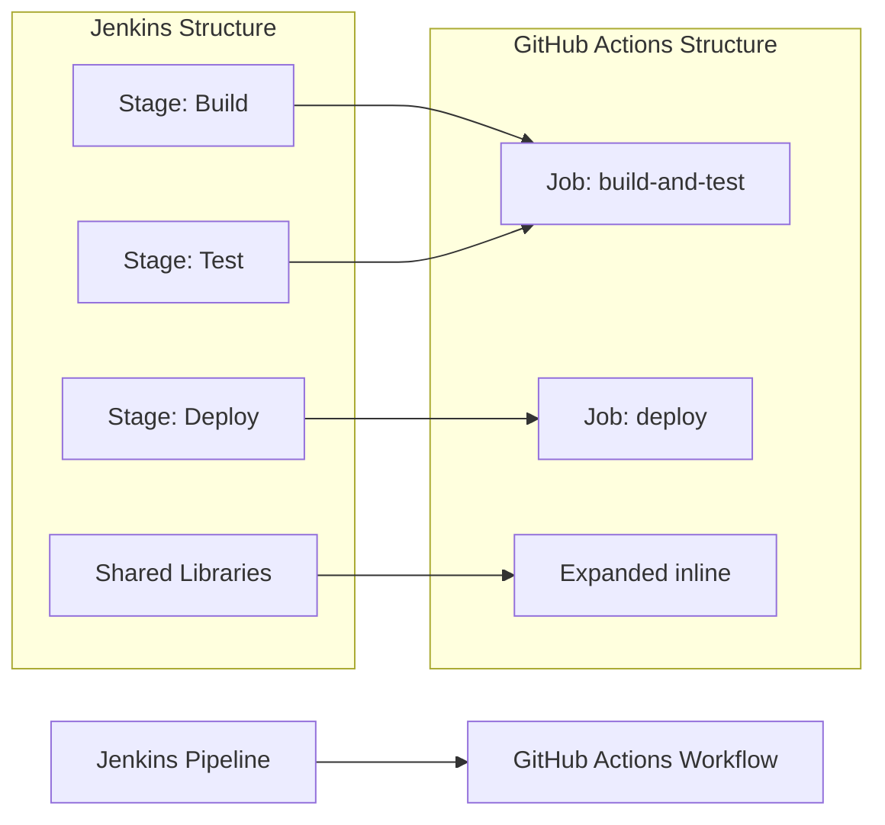

## 📄 MIGRATION REPORT TEMPLATE

Create `.github/ci-archive/MIGRATION-README.md` with this complete template:

```markdown

# 🚀 Jenkins to GitHub Actions Migration Report

## 📊 Migration Overview

| Metric           | Before (Jenkins) | After (GitHub Actions) |
| ---------------- | ---------------- | ---------------------- |
| Pipeline Files   | X files          | Y workflows            |
| Pipeline Stages  | X stages         | Y jobs                 |
| Pipeline Steps   | X steps          | Y steps                |
| Shared Libraries | X libraries      | Expanded inline        |
| Credentials      | X credentials    | Y secrets/variables    |

## 🔄 Conversion Diagram



## 🔧 Key Transformations

### Stage and Step Conversions:
- Jenkins stages → GitHub Actions jobs with dependencies
- Jenkins steps → GitHub Actions steps
- `checkout scm` → `actions/checkout@v4`
- `archiveArtifacts` → `actions/upload-artifact@v4`
- Groovy scripts → Shell scripts or marketplace actions
- Custom pipeline steps → Combined job steps

### Shared Library Expansions:
- Jenkins shared library calls → Expanded inline with marketplace actions
- Custom library functions → Shell scripts or GitHub Actions equivalents
- Reusable pipeline components → Reusable workflows or composite actions

### Credential and Environment Mappings:
- Jenkins credentials → GitHub Secrets for sensitive data
- Jenkins environment variables → GitHub Variables for non-sensitive configuration
- Credential bindings → GitHub Actions secrets references
- `BUILD_NUMBER` → `${{ github.run_number }}`
- `GIT_COMMIT` → `${{ github.sha }}`
- `BRANCH_NAME` → `${{ github.ref_name }}`

### Structural Changes:
- Combined sequential stages into single jobs where appropriate
- Converted parallel stages to concurrent jobs
- Improved caching with GitHub Actions cache
- Enhanced security with proper secret and variable management
- Added environment protection rules for deployments

## ✅ Validation Results

### Linting Results:
```
[VALIDATION_OUTPUT_ACTIONLINT]
```

### Manual Verification Checklist:
- [x] YAML syntax validated
- [x] All actions properly versioned
- [x] Job dependencies verified
- [x] Environment variables migrated
- [x] Secrets and variables properly referenced
- [x] Shared libraries expanded inline
- [x] Parallel stages converted to concurrent jobs
- [x] Triggers match original behavior

## 🔐 Security Improvements

- Migrated Jenkins credentials to GitHub Secrets for secure credential management
- Migrated Jenkins environment variables to GitHub Variables for non-sensitive configuration
- Implemented least-privilege permissions model with GitHub token permissions
- Added security scanning integration with marketplace actions
- Enhanced artifact management with proper secret and variable handling
- Used verified marketplace actions for secure integrations
- Configured environment protection rules for deployment jobs
- Separated sensitive credentials from configuration using appropriate storage types

## 📈 Performance Enhancements

- Added intelligent caching for dependencies and build artifacts
- Optimized job parallelization with concurrent execution
- Reduced build time through efficient marketplace actions
- Implemented proper artifact sharing between jobs
- Enhanced deployment speed with streamlined workflows

## 🔗 Variable and Secret Requirements

### Required GitHub Secrets:
- `DOCKER_USERNAME` - Docker Hub username (from Jenkins credentials)
- `DOCKER_PASSWORD` - Docker Hub password
- `AWS_ACCESS_KEY_ID` - AWS deployment credentials
- `AWS_SECRET_ACCESS_KEY` - AWS secret key
- `SSH_PRIVATE_KEY` - SSH deployment key
- [List other project-specific secrets migrated from Jenkins credentials]

### Required GitHub Variables:
- `BUILD_CONFIGURATION` - Build configuration setting
- `DEPLOYMENT_ENVIRONMENT` - Target deployment environment
- `ARTIFACT_VERSION` - Artifact versioning scheme
- [List other project-specific variables migrated from Jenkins environment variables]

## 🎯 Next Steps

1. **Configure secrets and variables** in GitHub repository settings
2. **Set up environments** with appropriate protection rules for deployments
3. **Configure branch protection rules** to match Jenkins requirements
4. **Test the workflow** by pushing to a feature branch
5. **Monitor execution** for any runtime issues
6. **Update team documentation** with new workflow information
7. **Train team members** on GitHub Actions workflow process

## 📁 Original Jenkins Files

The original Jenkins pipeline files have been moved to [`.github/ci-archive/`](.github/ci-archive/) for reference.

For a complete record of this migration, see [MIGRATION-README.md](.github/ci-archive/MIGRATION-README.md) in the archive folder.

## 📚 Migration Notes

[Include any specific notes about decisions made during migration,
 shared library expansions, plugin replacements, Groovy script conversions,
 potential issues to watch for, or special considerations for this project]

---
*Migration completed by GitHub Copilot Jenkins Migration Agent*
```
